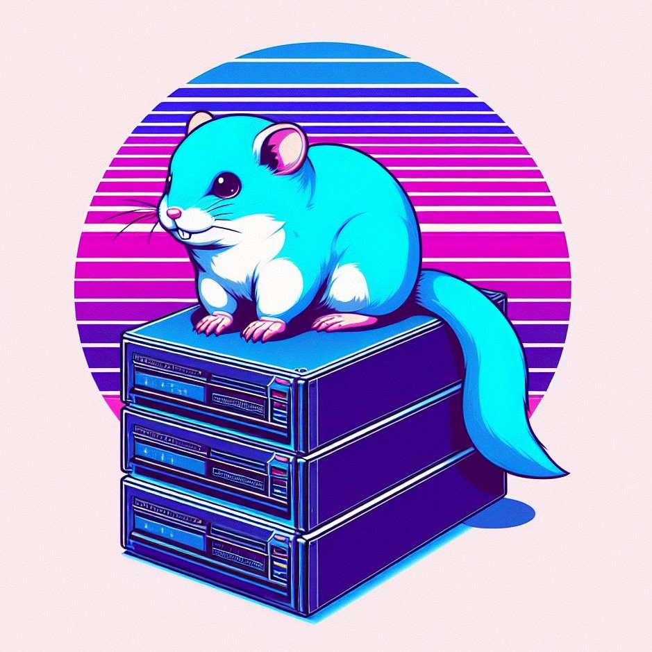

<p align="center">
    
</p>

## Overview
Welcome to the backend of the [Langmal](https://github.com/MikolajRatajczyk/Langmal-Apple) quiz app!
This project is written in [Go](https://go.dev/) and covered with unit tests.

## Quick start ⚡️
```sh
git clone https://github.com/MikolajRatajczyk/Langmal-Server.git
```
```sh
cd Langmal-Server
```
```sh
go run main.go
```
The server should now be running at `localhost:5001`.

## Config ⚙️
You may provide the full configuration by:
1. Switching to the release mode
```sh
export GIN_MODE=release
```
2. Setting the secret used for JWTs:
```sh
export LANGMAL_JWT_SECRET=YourSecret
```

## Running the tests ✅
```sh
go test ./...
```
